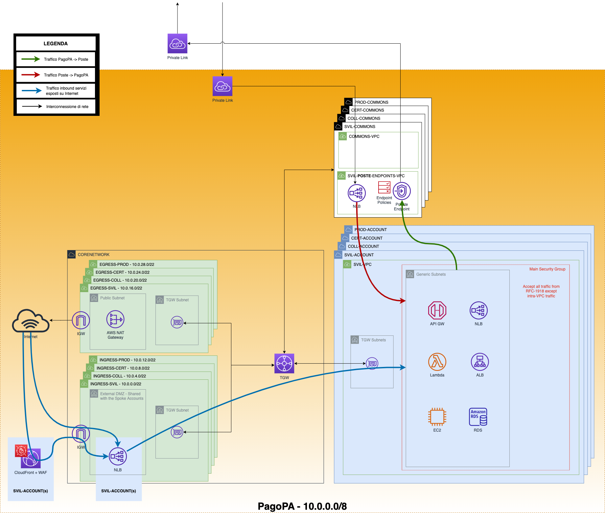

# Guida all'installazione di un singolo ambiente di Piattaforma Notifiche

Questo repository contiene le fonti che compongono il file [Guida all'installazione di un singolo ambiente di Piattaforma Notifiche](https://github.com/pagopa/pn-infra/tree/develop/installation). Segnala problemi e invia richieste pull per **correzioni di contenuti** qui. 

## Prima di cominciare

Per creare l'ambientes, sono necessarie le seguenti informazioni:

- Decidere il nome dell'ambiente, ad esempio _cert_, _dev_, _prod_, etc.
- Creare 4 account AWS:
  - __SPIDHUB__   
  -  __CONFIDENTIAL-INFORMATION__   
  -  __PN-CORE__   
  -  __HELPDESK__
- Per ognuno di questi account definire un profilo di AWS CLI con i diritti di amministrazione. 
  In seguito chiameremo questi profili:
  - __profilo_spidhub__ (relativo all'account _SPIDHUB_)
  - __profilo_confidential__ (relativo all'account _CONFIDENTIAL-INFORMATION_)
  - __profilo_core__ (relativo all'account _PN-CORE_)
  - __profilo_helpdesk__ (relativo all'account _HELPDESK_)   
  Per ulteriori informazioni, vedere [qui](https://docs.aws.amazon.com/cli/latest/userguide/cli-configure-role.html#cli-role-prepare).
- Comunicare ai gestori dell'account di Continuous Integration (Team Piattaforma Notifiche core) 
  gli AWS Account id _CONFIDENTIAL-INFORMATION_, _PN-CORE_, _HELPDESK_ allo scopo di abilitare 
  l'accesso agli artefatti da installare.
- Profilo __dns_delegator__: per definire questo profilo è necessario chiedere delle credenziali 
  per l'utente CreateDnsColl dell'account 946373734005 o per un ruolo equivalente. 
  Tale account (946373734005), allo stato attuale, contiene la zona DNS principale di Piattaforma
  Notifiche, ovvero _pn.pagopa.it_. Tali credenziali verranno usate solo nella fase 
  _Preparazione Networking_._Zone DNS pubbliche_ per creare una delega verso l'ambiente che si
  sta installando per la prima volta.
- Richiedere i __secrets__ contenenti le API key necessarie alla definizione dei secret come 
  descritto nella pagina "Configurazioni Secrets" di confluence.

# Preparazione Networking

### Prerequisiti
 - Account e profili descritti nel paragrafo _Prima di cominciare_


## VPC e Transit Gateway
- Definire networking tra account dello stesso ambiente come da diagramma
  .
  _Già implementato sull'infrastruttura attuale_

### Procedimento
  - Effettuare il clone del repository github [pn-infra](https://github.com/pagopa/pn-infra)
  - Effettuare il checkout del branch main
  - Impostare la directory corrente al folder `scripts/prepare-networking/pagopa_vpcs`
  - Eseguire lo script bash [create\_and\_share\_private\_hosted\_zones.sh](../scripts/prepare-networking/pagopa_vpcs/
prepare_networking_on_dev.sh ) seguendo la seguente parametrizzazione:

    ```
    ./prepare_networking_on_dev.sh \
        -r <aws-region> \
        -p-core <aws-profile> \
        -p-helpdesk <aws-profile> \
        -p-confidential <aws-profile> \
        -p-spidhub <aws-profile> \

- `<aws-profile>` deve essere sostituito col il _Nome di profile_ creato nel _Prima di cominciare_

## Zone DNS private

### Prerequisiti
 - aver completato gli step precedenti.

### Scopo
 - in ognuno degli account _CONFIDENTIAL-INFORMATION_, _PN-CORE_, _HELPDESK_ dovrà essere presente
   una private hosted zone e i nomi DNS registrati dovranno essere risolvibili da ognuno degli account
   nominati.

### Procedimento
  - Effettuare il clone del repository github [pn-infra](https://github.com/pagopa/pn-infra)
  - Effettuare il checkout del branch main
  - Impostare la directory corrente al folder `scripts/prepare-networking/private_hosted_zones`
  - Eseguire lo script bash [create_and_share_private_hosted_zones.sh](../scripts/prepare-networking/private_hosted_zones/create_and_share_private_hosted_zones.sh) 
    seguendo la seguente parametrizzazione:
    
    ```
    ./create_and_share_private_hosted_zones.sh \
        -p-1 profilo_core \
        -d-1 core.pn.internal \
        -v-1 <id-della-vpc-privata-account-core> \
        \
        -p-2 profilo_helpdesk \
        -d-2 helpdesk.pn.internal \
        -v-2 <id-della-vpc-privata-account-helpdesk> \
        \
        -p-3 profilo_confidential \
        -d-3 confidential.pn.internal \
        -v-3 <id-della-vpc-privata-account-confidential-info>
    ```
  - `<id-della-vpc-privata-account-core>` deve essere sostituito col il _VPC id_ della VPC
    privata presente nell'account _PN-CORE_.
  - `<id-della-vpc-privata-account-helpdesk>` deve essere sostituito col il _VPC id_ della VPC
    privata presente nell'account _HELPDESK_.
  - `<id-della-vpc-privata-account-confidential-info>` deve essere sostituito col il _VPC id_ 
    della VPC privata presente nell'account _CONFIDENTIAL-INFORMATION_.

### Test
  - Per ogni account _CONFIDENTIAL-INFORMATION_, _PN-CORE_, _HELPDESK_ creare macchine EC2 nelle 
    VPC private ed eseguire i comandi
    - `dig -t TXT testdns.core.pn.internal` 
      il cui risultato atteso è _"Test DNS entry for Zone core.pn.internal"_
    - `dig -t TXT testdns.helpdesk.pn.internal` 
      il cui risultato atteso è _"Test DNS entry for Zone helpdesk.pn.internal"_
    - `dig -t TXT testdns.confidential.pn.internal` 
      il cui risultato atteso è _"Test DNS entry for Zone confidential.pn.internal"_


## Zone DNS pubbliche

### Prerequisiti
 - aver completato con successo gli step precedenti.

### Scopo
 - Generare un dominio DNS nella forma `<nome-ambiente>.pn.pagopa.it` in cui registrare i DNS delle api 
   e delle applicazioni web dello specifico ambiente di piattaforma notifiche.

### Procedimento
  - Effettuare il clone del repository github [pn-infra](https://github.com/pagopa/pn-infra)
  - Effettuare il checkout del branch main
  - Impostare la directory corrente al folder `scripts/dns-zone-and-server-certificates`
  - Eseguire lo script bash [ensure-public-dns-and-certificates.sh](../scripts/dns-zone-and-server-certificates/ensure-public-dns-and-certificates.sh) 
    seguendo la seguente parametrizzazione:
    
    ```
    ./ensure-public-dns-and-certificates.sh \
        -e <nome-ambiente> \
        -p profilo_core \
        -P profilo_dns_delegator \
        -l profilo_spidhub
    ```
    Dove `<nome-ambiente>` va sostituito, ad esempio, con _"cert"_
### Test
  - Da un computer esterno ad AWS 
    - il comando `dig -t TXT testdns.<nome-ambiente>.pn.pagopa.it` 
      deve rispondere _"Test DNS entry for PN <nome-ambiente>"_
    - il comando `dig -t TXT testdns.spid.<nome-ambiente>.pn.pagopa.it` 
      deve rispondere _"Test DNS entry for PN SPID <nome-ambiente>"_
  - Nell'account _PN-CORE_ devono essere presenti e in stato issued i seguenti certificati:
    - Region _eu-south-1_: api.\<nome-ambiente\>.pn.pagopa.it, webapi.\<nome-ambiente\>.pn.pagopa.it, api-io.\<nome-ambiente\>.pn.pagopa.it
    - Region _us-east-1_: portale.\<nome-ambiente\>.pn.pagopa.it, portale-pa.\<nome-ambiente\>.pn.pagopa.it, portale-login.\<nome-ambiente\>.pn.pagopa.it

## Accesso agli artefatti di cui fare deploy
Comunicare a PagoPA gli AccountID di pn-core e pn-configential-information specifici per l'ambiente. 
Tali account id verranno usati per l'abilitazione in lettura ai repository ECR e ai bucket contenenti 
gli artefatti di cui fare deploy.

# Installazione SpidHub

## Prerequisiti
  - Aver completato con successo gli step precedenti.
  - Avere un api-key di accesso a UserRegistry. Vedere pagina "Configurazioni Secrets" di confluence
  - [Docker](https://www.docker.com/) o altro servizio per creare immagini di container.

## Scopo
Installare il sistema di login utilizzato dai destinatari delle notifiche.

## Preparazione dei file di configurazione
- Clonare il repository [pn-hub-spid-login-aws](https://github.com/pagopa/pn-hub-spid-login-aws)
- Nella cartella _"pn-spid-login-aws/scripts/deploy/environments"_ sono presenti le sottocartelle 
  contenenti le configurazioni, una per ambiente. Allo stato attuale i nuovi ambienti vengono creati
  copiando una cartella e sostituendo il nome dle vecchio ambiente con il nuovo.


  Fanno eccezione alcuni parametri del file __params.json__
  - __FrontEndVpcId__: deve essere valorizzato con l'id della VPC PAGOPA-HUBSPIDLOGIN-INGRESS-\<NOME_AMBIENTE\>-VPC
  - __BackEndVpcId__: deve essere valorizzato con l'id della VPC PAGOPA-HUBSPIDLOGIN-PRIVATE-\<NOME_AMBIENTE\>-VPC
  - __FrontEndSubnets__: deve essere valorizzato con gli id delle subnet PAGOPA-HUBSPIDLOGIN-INGRESS-\<NOME_AMBIENTE\>-DMZ-A, PAGOPA-HUBSPIDLOGIN-INGRESS-\<NOME_AMBIENTE\>-DMZ-B, PAGOPA-HUBSPIDLOGIN-INGRESS-\<NOME_AMBIENTE\>-DMZ-C
  - __BackEndSubnets__: deve essere valorizzato con gli id delle subnet PAGOPA-HUBSPIDLOGIN-PRIVATE-\<NOME_AMBIENTE\>-GENERIC-A, PAGOPA-HUBSPIDLOGIN-PRIVATE-\<NOME_AMBIENTE\>-GENERIC-B, PAGOPA-HUBSPIDLOGIN-PRIVATE-\<NOME_AMBIENTE\>-GENERIC-C
  - __InternalNlbIps__: "10.<BackEndVpc-CIDR-second-octect-from-left>.63.200,10.<BackEndVpc-CIDR-second-octect-from-left>.127.200,10.<BackEndVpc-CIDR-second-octect-from-left>.191.200"
  - __HostedZoneId__: deve essere valorizzato lo zone id della hosted zone spid.\<nome_ambiente\>.pn.pagopa.it

## Procedimento d'installazione
  - Eseguire il comando 
    ```
      aws --profile profilo_spidhub \
        iam create-service-linked-role \
            --aws-service-name ecs.amazonaws.com
    ```
    Per assicurarsi che l'utente possa creare cluster ECS.
  
 - Eseguire il comando
   ```
   ./setup.sh profilo_spidhub eu-south-1 <nome_ambiente> <UserRegistryApiKeyForPF>
   ```
   Ove `UserRegistryApiKeyForPF` va valorizzato con il valore _UserRegistryApiKeyForPF_ 
   del secret _pn-PersonalDataVault-Apikey_
- Quando il deploy dello stack è terminato bisogna:
  - Accedere alla console web del servizio AWS ECS dell'account _SPIDHUB_ regione eu-south-1.
  - Selezionare il cluster ECS presente
  - Riavviare tutti i task del servizio `spidhub-<nome-ambiente>-hub-login`. Questo riavvio serve
    per supportare l'idp di test (non necessario in prod perché non sarà necessario l'idp di test).

### Test
  - Dal proprio browser navigare all'url `https://hub-login.spid.<nome-ambiente>.pn.pagopa.it/login?entityID=xx_testenv2&authLevel=SpidL2`
  - Effettuare il login con le credenziali di un utente di test
  - Verificare che, dopo la login, la navigazione venga direzionata all'url `https://portale.<nome-ambiente>.pn.pagopa.it/`


# Installazione DATA VAULT

## Precondizioni

### Preparazione configurazioni

Nel repository configurato su AWS CodeCommit nell'ambiente su cui si sta agendo e nella regione _eu-south-1_, aggiungere le configurazioni relative al
nuovo ambiente (ad esempio cert) come descritto di seguito.

Le configurazioni sono composte da tre file:

- Il file `https://github.com/pagopa/pn-data-vault/blob/main/scripts/aws/cfn/once4account/svil.yaml` che va 
  ricopiato nel nuovo repository CodeCommit in `pn-data-vault/scripts/aws/cfn/once4account/<nome_ambiente>.yaml` ed __eventualmente personalizzato con l'invio degli allarmi su slack o per mail. 
  Fondamentale è mantenere gli output esistenti__.
- Il file `https://github.com/pagopa/pn-data-vault/blob/main/scripts/aws/cfn/microservice-svil-cfg.json` che va ricopiato in
  `pn-data-vault/scripts/aws/cfn/microservice-<nome_ambiente>-cfg.json` e modificato nei seguenti parametri:
  - __VpcCidr__: CIDR della VPC PAGOPA-\<NOME_AMBIENTE\>-CONFIDENTIALINFO-VPC
  - __VpcSubnetsRoutingTables__: id della tabella di routing PAGOPA-\<NOME_AMBIENTE\>-CONFIDENTIALINFO-GENERIC-RT
  - __PrivateHostedZone__: id della hosted zone privata `confidential.pn.internal` presente nell'account _CONFIDENTIAL-INFORMATION_,
  - __EcsDefaultSecurityGroup__: id del security group PAGOPA-\<NOME_AMBIENTE\>-CONFIDENTIALINFO-MAIN-SG,
  - __PDVTokenizerBasePath__ : url del tokenizer del servizio PersonalDataVault di pagopa (ES: "https://api.uat.tokenizer.pdv.pagopa.it/tokenizer/v1")
  - __PDVUserRegistryBasePath__ : url dello user registry del servizio PersonalDataVault di pagopa 
      (ES: "https://api.uat.pdv.pagopa.it/user-registry/v1")
- Il file `https://github.com/pagopa/pn-data-vault/blob/main/scripts/aws/cfn/infra-svil-cfg.json` che va ricopiato in
  `pn-data-vault/scripts/aws/cfn/infa-<nome_ambiente>-cfg.json` e modificato nei seguenti parametri:
    - __VpcId__: Id della VPC PAGOPA-\<NOME_AMBIENTE\>-CONFIDENTIALINFO-VPC
    - __VpcSubnets__: id, separati da virgola, delle sotto reti PAGOPA-\<NOME_AMBIENTE\>-CONFIDENTIALINFO-GENERIC-A, PAGOPA-CERT-CONFIDENTIALINFO-GENERIC-B, PAGOPA-CERT-CONFIDENTIALINFO-GENERIC-C
- Caricare i file sul repository delle configurazioni preparato secondo l'appendice "Preparare il repository delle configurazioni"

### Preparazione file con la versioni degli script di deploy (__desired-commit-ids-env.sh__)
- Va scaricato dall'ambiente di collaudo il file 
 `s3://cd-pipeline-datavault-cdartifactbucket-1lf70f4dd9hib/config/desired-commit-ids-env.sh`
Nota: l'id del bucket dopo _cdartifactbucket_ è generato dinamicamente da AWS Cloud Formation.

## Procedimento d'installazione

Tutte le operazioni vanno eseguite nell'account _CONFIDENTIAL-INFORMATION_ nella regione _eu-south-1_
- Definire un secret di tipo "Altro tipo di segreto" in "AWS Secrets Manager". Tale secret avrà nome 
  "pn-PersonalDataVault-Apikey" e contenente le necessarie API-Key. Il valore è presente nella pagina 
  confluence _Configurazioni Secrets_ al paragrafo _pn-PersonalDataVault-Apikey_.
- Tramite console web del servizio AWS CloudFormation effettuare il deploy del template 
  [data-vault-only-pipeline.yaml](https://github.com/pagopa/pn-cicd/blob/main/cd-cli/cnf-templates/data-vault-only-pipeline.yaml)
  __Va specificato il parametro EnvName__
- Nello stack creato al punto precedente localizzare la risorsa "Bucket S3" con nome logico _CdArtifactBucket_
- Nel bucket _CdArtifactBucket_ creare la cartella __config__
- Nel bucket _CdArtifactBucket_ caricare:
  - il file [empty.zip](https://github.com/pagopa/pn-cicd/blob/main/cd-cli/cnf-templates/empty.zip) sulla radice
  - il file _desired-commit-ids-env.sh_ preparato in precedenza nella cartella _config_
- Eseguire la pipeline _pn-env-update-pipeline_

## Test
- Verificare che sia stato creato un cluster ECS con nome _pn-confidential-ecs-cluster_ e che abbia
  un servizio con nome che cominci per _pn-data-vault-microsvc-\<nome_ambiente\>-DataVaultMicroservice-_ in esecuzione.


# Installazione PN-CORE

## Precondizioni
  
### Networking
Verificare che le subnet della VPC PAGOPA-COLL-PNCORE-VPC possano raggiungere i servizi di 
SafeStorage e ExternalChannel.
Gli URL di tali servizi sono reperibili sull'API gateway dell'account del fornitore di tali servizi.

### Pacchettizzazione Front End

Richiedere al team di front-end di aggiungere gli artifact dei siti web dedicati all'ambiente specifico.

### Preparazione configurazioni

Breve sintesi dei parametri da configurare per maggiori dettagli riferirsi alla pagina confluence
[Configurazioni Prodotto](https://pagopa.atlassian.net/wiki/spaces/PN/pages/527433857/Configurazioni+prodotto).

Nel repository configurato su AWS CodeCommit nell'ambiente su cui si sta agendo e nella regione _eu-south-1_, aggiungere le configurazioni relative al
nuovo ambiente (ad esempio cert).
Le configurazioni, allo stato attuale, sono ottenibili da quelle di un altro ambiente sostituendo il nome dell'ambiente 
vecchio con il nuovo.

Modificare i seguenti parametri:

- File `pn-delivery/scripts/aws/cfn/microservice-<nome_ambiente>-cfg.json`
  - __SandboxSafeStorageBaseUrl__: valorizzato all'url di safe-storage dello specifico ambiente
- File `pn-delivery-push/scripts/aws/cfn/microservice-<nome_ambiente>-cfg.json`
  - __SandboxSafeStorageBaseUrl__: valorizzato all'url di safe-storage dello specifico ambiente
  - __ExternalChannelBaseUrl__ che va valorizzato all'url di external-channel dello specifico ambiente
- File `pn-frontend/aws-cdn-templates/<nome_ambiente>/env-cdn.sh`
  - __ZONE_ID__: valorizzato con l'identificativo della zona \<nome-ambiente\>.pn.pagopa.it letto dalla console di Route53
  - __PORTALE\_PA\_CERTIFICATE\_ARN__: valorizzato con l'arn del certificato per l'URL portale-pa.<nome_ambiente>.pn.pagopa.it 
      (letto sulla console del Aws Certificate Manager nella zona 'N. Virginia')
  - __PORTALE\_PF\_CERTIFICATE\_ARN__: valorizzato con l'arn del certificato per l'URL portale.<nome_ambiente>.pn.pagopa.it
      (letto sulla console del Aws Certificate Manager nella zona 'N. Virginia)'
  - __PORTALE\_PF\_LOGIN\_CERTIFICATE\_ARN__: valorizzato con l'arn del certificato per l'URL portale-login.\<nome_ambiente\>.pn.pagopa.it
      (letto sulla console del Aws Certificate Manager nella zona 'N. Virginia)'
  - Frammento __&lt;NomeBucketLegalInput&gt;__: sostituito con il nome del bucket utilizzato 
    per l'input di allegati alle notifiche per lo specifico ambiente (Es: pnsafestoragecert-nonlegal-input-eu-south-1)
- File `pn-infra/runtime-infra/pn-infra-<nome_ambiente>-cfg.json`
  - __VpcId__: Id della VPC PAGOPA-CERT-PNCORE-VPC
  - __VpcCidr__: CIDR della VPC PAGOPA-CERT-PNCORE-VPC
  - __VpcSubnets__: id delle sottoreti PAGOPA-<NOME_AMBIENTE>-PNCORE-GENERIC-A, PAGOPA-<NOME_AMBIENTE>-PNCORE-GENERIC-B, PAGOPA-<NOME_AMBIENTE>-PNCORE-GENERIC-C
  - __VpcSubnetsRoutingTables__: id della tabella di routing PAGOPA-<NOME_AMBIENTE>-PNCORE-GENERIC-RT
  - __PrivateHostedZone__: id della hosted zone privata `core.pn.internal` presente nel servizio Route53 dell'account _PN-CORE_,
  - __EcsDefaultSecurityGroup__: id del security group PAGOPA-<NOME_AMBIENTE>-PNCORE-MAIN-SG,
  - __LogsBucketName__: nome del bucket in cui verranno memorizzati i log: "pn-logs-bucket-eu-south-1-&lt;AccountID&gt;-001"
      dove &lt;AccountID&gt; viene sostituito con il numero dell'account AWS di PN-CORE,
  - __LogsAccountId__: l numero dell'account AWS di PN-CORE,
  - __BucketSuffix__: "001",
  - __DataLakeAccountId1__: per certificazione va bene il numero dell'account AWS di PN-CORE per prod serve l'account id 
      dell'ambiente di produzione di DataLake che dovrà essere comunicato da PagoPA,
  - __DataLakeAccountId2__: serve solo in ambiente dev, in tutti gli altri ambienti deve essere valorizzato con '-'
  - __RaddApiCertificateArn__: ARN del certificato per api-radd.\<NOME_AMBIENTE\>.pn.pagopa.it
  - __RaddApiDnsName__: Nome del DNS per la RADD API, api-radd.\<NOME_AMBIENTE\>.pn.pagopa.it
  - __HostedZoneId__: ID della hosted zone dove registrare il DNS della RADD API
  - __InternalNlbIps__: Lista degli IP degli internal NLB; bisogna scegliere IP della private subnet nella VPC interna, non ancora utilizzati (prendere uno degli ultimi disponibili)

- File `pn-infra/runtime-infra/pn-ipc-<nome_ambiente>-cfg.json`
  - __ApiCertificateArn__: ARN del certificato per il DNS api.\<nome-ambiente\>.pn.pagopa.it
  - __WebApiCertificateArn__: ARN del certificato per il DNS webapi.\<nome-ambiente\>.pn.pagopa.it
  - __IoApiCertificateArn__: ARN del certificato per il DNS api-io.\<nome-ambiente\>.pn.pagopa.it
  - __HostedZoneId__: l'id della zona DNS \<nome_ambiente\>.pn.pagopa.it
  - __SafeStorageAccountId__: l'id dell'account AWS in cui si trovano safe-storage ed external channel
- File `pn-user-attributes/scripts/aws/cfn/microservice-<nome_ambiente>-cfg.json`
  - __ExternalChannelBasePath__: l'url di external-channel per lo specifico ambiente

- Caricare i file sul repository delle configurazioni preparato secondo l'appendice "Preparare il repository delle configurazioni".
  __N.B.__: è un repository separato da quello di pn-confidentialinformation.

La lista dei servizi da configurare, per i quali ci si aspetta una cartella dedicata nel repository delle configurazioni, è la seguente:

  - pn-auth-fleet
  - pn-delivery
  - pn-delivery-push
  - pn-downtime-logs
  - pn-external-registries
  - pn-frontend
  - pn-infra
  - pn-logsaver-be
  - pn-mandate
  - pn-radd-fsu
  - pn-user-attributes

### Preparazione file con i _commit-id_ (__desired-commit-ids-env.sh__)

- Va scaricato dall'ambiente di collaudo il file 
 `s3://cd-pipeline-cdartifactbucket-4z3nf89jd2zy/config/desired-commit-ids-env.sh`
Nota: l'id del bucket dopo _cdartifactbucket_ è generato dinamicamente da AWS Cloud Formation.

## Procedimento d'installazione

Tutte le operazioni vanno eseguite nell'account _PN-CORE_ nella regione _eu-south-1_

- Definire parametri su AWS Parameter Store; se non esplicitamente forniti, i valori vanno reperiti da un altro ambiente AWS già configurato, ad esempio `dev`:
  - un parametro con nome=MockPaList tier=standard type=string dataType=text
- Definire segreti su Amazon Secret Manager; se non esplicitamente forniti, i valori vanno reperiti da un altro ambiente già configurato, ad esempio `dev`.
  - un segreto con nome=pn-ExternalRegistries-Secrets secretType=other plaintext=&lt;il valore fornito da pagopa&gt; 
    gli altri parametri vengono lasciati al default
  - un segreto con nome=pn-logs-data-lake-role-access secretType=other plaintext=&lt;il valore fornito da pagopa&gt; 
    gli altri parametri vengono lasciati al default
- Tramite console web del servizio AWS CloudFormation effettuare il deploy del template 
  [complete-pipeline.yaml](https://github.com/pagopa/pn-cicd/blob/main/cd-cli/cnf-templates/complete-pipeline.yaml).
  __Va specificato il parametro EnvName__
- Nello stack creato al punto precedente localizzare la risorsa "Bucket S3" con nome logico _CdArtifactBucket_
- Nel bucket _CdArtifactBucket_ creare la cartella __config__
- Nel bucket _CdArtifactBucket_ caricare:
  - il file [empty.zip](https://github.com/pagopa/pn-cicd/blob/main/cd-cli/cnf-templates/empty.zip) sulla radice
  - il file _desired-commit-ids-env.sh_ preparato in precedenza nella cartella _config_
- Eseguire la pipeline _pn-env-update-pipeline_

## Test

Testare il nuovo ambiente di PN


# Appendici

## Preparare il repository delle configurazioni
Per gli account _pn-core_ e _pn-confidential-information_ degli ambienti cert e prod sarà necessario definire un repository codecommit contenente i parametri di configurazione per il software in esecuzione in tale account. 
Eseguire i seguenti passi, sempre usando l'account in questione:

- [Creare un repository codecommit](https://docs.aws.amazon.com/codecommit/latest/userguide/how-to-create-repository.html)
  - con nome `<account-name>-configurations-<env-name>` ove _env-name_ può essere `cert`, `prod` ...
- [Configurare un utenza IAM](https://docs.aws.amazon.com/IAM/latest/UserGuide/id_users_create.html) 
  - con nome config_reader, 
  - che abbia diritto di lettura sul repository appena creato (ad esempio associandolo alla managed 
    policy _AWSCodeCommitReadOnly_).
- [Generare credenziali CodeCommit](https://docs.aws.amazon.com/codecommit/latest/userguide/setting-up-gc.html) 
  per l'utenza appena creata.
- Definire un secret di tipo "Altro tipo di segreto" in "AWS Secrets Manager". Tale secret avrà nome 
  "pn-configurations-repository" e come valore avraà due coppie chiave valore.
  - Nella chiave _repositoryUrl_ il valore dell'url di clone del repository con tanto di nume utente e 
    la versione url encoded della password nella forma _https://{username}:{password}@<repository_base_url>_
  - Nella chiave _commitId_ la stringa da utilizzare per il checkout della corretta versione delle configurazioni (può essere usato anche _main_).


