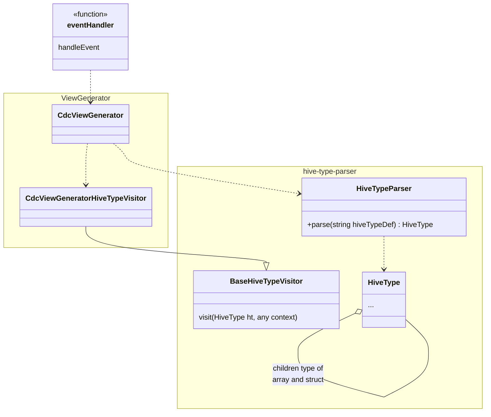

# Application Structure

- [eventHandler.js](./eventHandler.js) entry point of 
  [CloudFormation Transformation](https://docs.aws.amazon.com/AWSCloudFormation/latest/UserGuide/template-macros.html) 
  lambda
- [view-generator](./view-generator/) code to generate 
  [Athena Views](https://docs.aws.amazon.com/athena/latest/ug/views.html) for CDC starting 
  from dynamo records and keys hive type definition
- [hive-type-parser](./hive-type-parser/) code used for parsing hive type definition

## Class diagram: very important methods only



# Lambda Parameter description
__bold__ are required _italic_ are optionals

- __CatalogName__: [AWS Glue catalog](https://docs.aws.amazon.com/athena/latest/ug/querying-glue-catalog.html) 
  name where the view will be registered
- __DatabaseName__: [AWS athena database](https://docs.aws.amazon.com/athena/latest/ug/understanding-tables-databases-and-the-data-catalog.html) 
  name where the view will be registered
- __CdcTableName__: name of the view source. Must be a table based on dynamo event stream 
  written on S3 by kinesis data stream and kinesis firehouse destination stream.
- __CdcViewName__: the name of the view created by this transformation.
- __CdcKeysType__: the key structure of the original dynamo record
- __CdcNewImageType__: the structure of the entire original dynamo record
- _CdcRecordFilter_: some filter on the records
- __OutputType__: enum, allowed values are:
  - ```StorageDescriptor-Columns```: generate object array for 
    [AWS::Glue::Table TableInput StorageDescriptor Columns](https://docs.aws.amazon.com/AWSCloudFormation/latest/UserGuide/aws-properties-glue-table-storagedescriptor.html#cfn-glue-table-storagedescriptor-columns)
    CloudFormation property.
  - ```ViewOriginalText```: generate string for
    [AWS::Glue::Table TableInput ViewOriginalText](https://docs.aws.amazon.com/AWSCloudFormation/latest/UserGuide/aws-properties-glue-table-tableinput.html#cfn-glue-table-tableinput-vieworiginaltext)
    CloudFormation property.
- __Enabled__: if not equals to string ```true``` then a fake output is returned and parsing is not done.

