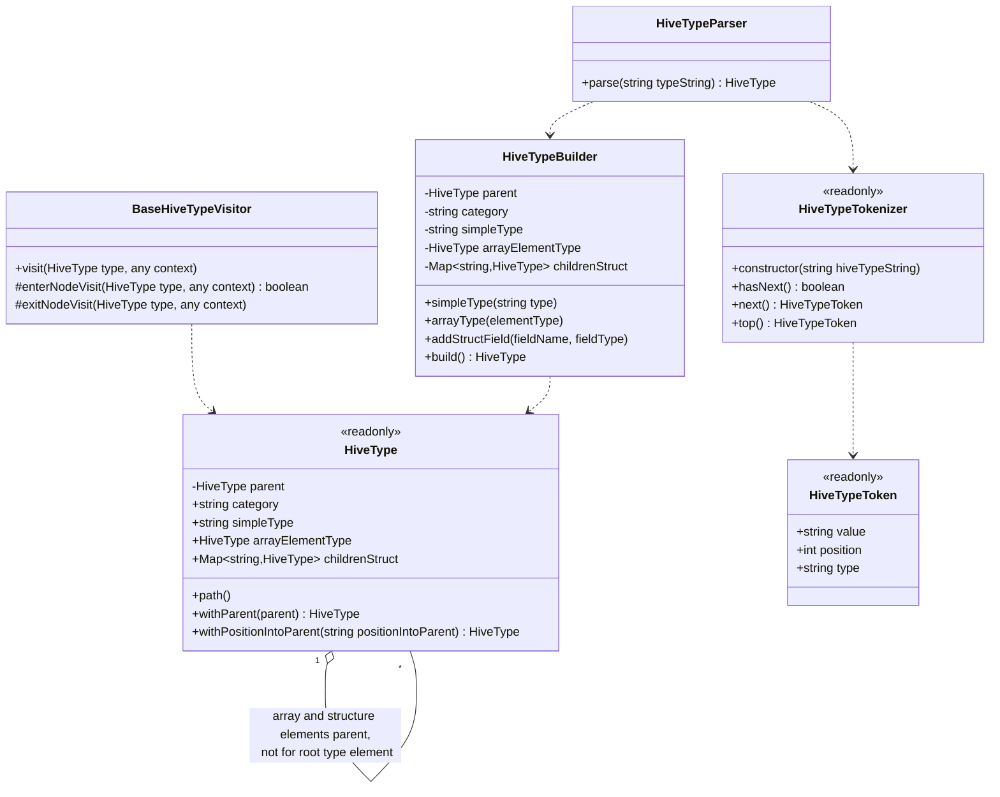

# Package scope

Other packages can use class [```HiveTypeParser```](./HiveTypeParser.js) to translate a 
type string into an object tree of [```HiveType```](./HiveType.js) class instances.

After that they can use [```BaseHiveTypeVisitor```](./BaseHiveTypeVisitor.js) or a subclass 
to visit the syntax tree of the type definition.

The syntax supported by the [```HiveTypeParser::parse```](./HiveTypeParser.js#L8)<!-- ./HiveTypeParser.js::parse-->
is documented in _data_type_ grammar rule of the 
["_Create Table_" statement LanguageManualDDL](https://cwiki.apache.org/confluence/pages/viewpage.action?pageId=27362034#LanguageManualDDL-CreateTable)
with a lot of limitations:
- Only ```primitive_type```, ```array_type```, ```struct_type``` are supported.
- ```primitive_type``` do not support _precision_ and _scale_ attributes
- ```struct_type``` do not support COMMENT keyword


# Package class list
The more important classes of this package are
- [```HiveType```](./HiveType.js): a simple representation of an [hive](https://hive.apache.org/) 
  type syntax tree
- [```BaseHiveTypeVisitor```](./BaseHiveTypeVisitor.js) used to visit an _HiveType_ for further elaboration
- [```HiveTypeParser```](./HiveTypeParser.js) parse a string and obtain an _HiveType_

There are also some helper classes:
- [```HiveTypeBuilder```](./HiveTypeBuilder.js): help to keep _HiveType_ immutable
- [```HiveTypeTokenizer```](./HiveTypeTokenizer.js): split the hive type string into multiple tokens
- [```HiveTypeToken```](./HiveTypeToken.js): ```:```, ```,```, ```<```, ```struct```, ....


# Class diagram: very important methods only

