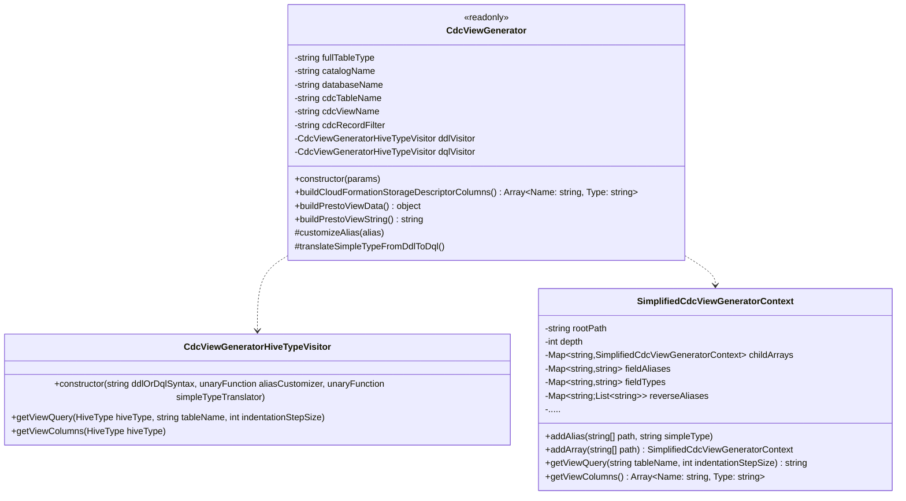

# Package abstract

Generate hive schema information and view SQL for athena

Starting from dynamo record key structure definition and full dynamo record structure definition generate 
a view with the following structure:
- ```stream_awsregion:string```: dynamo table AWS region,
- ```stream_eventid:string```: dynamo stream event id: useful for deduplication,
- ```stream_eventname:string```: 'INSERT', 'UPDATE', 'REMOVE',
- ```stream_useridentity:string```: useful to distinguish from ttl REMOVE and application REMOVE,
- ```stream_recordformat:string```: usually "application/json",
- ```stream_tablename:string```: name of the dynamo table,
- ```dynamodb_SizeBytes:bigint```: record dimension in byte,
- ```p_year:string```: year when the firehouse destination stream has written the event on S3 log bucket,
- ```p_month:string```: month when the firehouse destination stream has written the event on S3 log bucket,
- ```p_day:string```: day when the firehouse destination stream has written the event on S3 log bucket,,
- ```p_hour:string```: hour when the firehouse destination stream has written the event on S3 log bucket,,
- ```kinesis_dynamodb_ApproximateCreationDateTime:string```: approximate event creation timestamp,
- ```dynamodb_keys_<key_field>:<key_filed_type>```: one entry for each dynamo record key field,
- ```<table_field>:<table_field_type>```: one entry for each dynamo record field.<br>
  Nested structure are flattered replacing nested field descend operator ()```.```) with underscore 
  (```_```) character.<br>
  Array element are preserved generating view columns of type array with structured elements.


# Package class list
The more important classes of this package are
- [```CdcViewGenerator```](./CdcViewGenerator.js): entry point for view creation functionality

There are also some helper classes:
- [```SimplifiedCdcViewGeneratorContext```](./SimplifiedCdcViewGeneratorContext.js): memoize 
  hive type structure with un-nested ```struct``` and generate the view sql query.
- [```CdcViewGeneratorHiveTypeVisitor```](./CdcViewGeneratorHiveTypeVisitor.js): visit the 
  hive type and fill the context


# Class diagram: very important methods only


