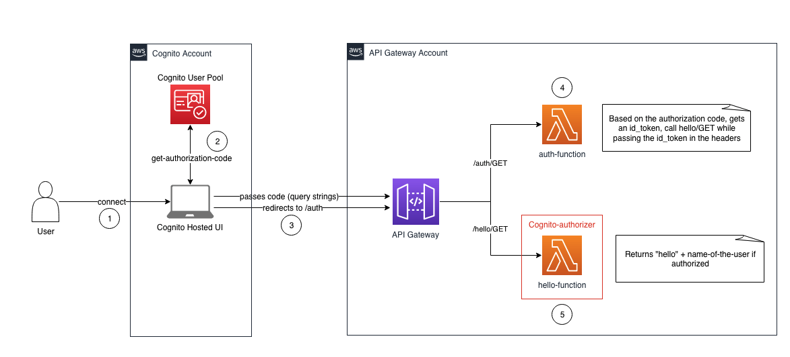

# Architecture



# How to deploy

1. Make sure you have AWS Credentials profiles for the Cognito and API Gateway accounts. If not, follow the instructions here: https://docs.aws.amazon.com/cli/latest/userguide/cli-configure-profiles.html

2. Launch the bash script with the following parameters:
- REGION: region to deploy the templates in
- COGNITO_PROFILE: name of the profile where the Cognito User Pool will be deployed
- API_PROFILE: name of the profile where the API Gateway will be deployed
- DOMAIN_NAME: name of the domain for your Cognito User Pool (choose one likely to be unique, otherwise deployment will fail)

```
./bash-script.sh REGION=us-east-1 COGNITO_PROFILE=<name-of-profile> API_PROFILE=<name-of-profile> DOMAIN_NAME=<name-of-the-domain>
```

3. The Cognito Hosted UI cannot be deployed programmatically, so follow the steps here to create it: https://docs.aws.amazon.com/cognito/latest/developerguide/cognito-user-pools-app-integration.html#cognito-user-pools-create-an-app-integration. 

a. Start from "Configure the app"

b. Input the following parameters:
- Input as callback URL the output of the API Gateway Stack (CallbackURL)
- Select 'Authorization code grant' only 
- Select ''
4. Click on View the Hosted UI, Sign-in and you'll be greeted with "Hello" + name of the user you connected with

