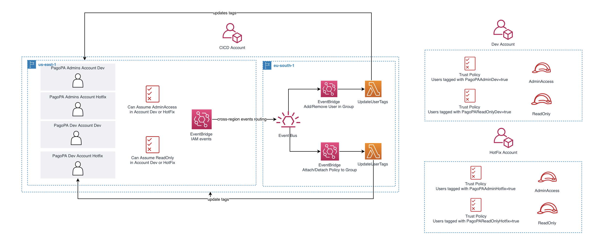

# Overview
Those templates aim at providing a dynamic way to allow users in a central account (here, the CICD account) to access other accounts (here, the Dev and Hotfix accounts), with specific permissions. 

The use case is the following: 
- Admin Users, part of specific IAM Groups, in the CICD Account wish to assume AdministratorAccess in the other accounts
- Developers, part of specific IAM Groups, in the CICD Account wish to assume ReadOnlyAccess in the other accounts
- When a new Admin User joins one of the Admin Group, they need to be able to assume the AdministratorAccess in the other accounts
- When a new Developer joins one of the Developer Group, they need to be able to assume the ReadOnlyAccess in the other accounts
- No manual action should be done to operate this cross-account access
- The environments must remain secure and the least privileged principle is to be applied

# Architecture



In this architecture, users are tagged with the tags of the policies attached to the IAM Group they belong to. Proceeding like this allows to only focus on the tags of the policies that allow this cross-account access. 

For example, let's assume we have the following policies:
- Policy A: allows to assume the ReadOnlyAccess role in Dev
- Policy B: allows to assume the AdminAccess role in Dev
- Policy C: allows to assume the AdminAccess role in Hotfix

And the following IAM Groups, with their policies:
- Italy Developers: Policy A
- France Developers: Policy A
- Spain Developers: Policy A
- Italy Super Developers: Policy B
- France Super Developers: Policy B
- Executive Team: Policy B, Policy C

With this architecture, the ReadOnlyAccess role in Dev can be assumed if users bear the tag of the Policy A. That is, the Italy, France and Spain Developers can assume this role in Dev and only by specifying one tag condition in the trust policy.

Overall, here are the main benefits of this architecture:
- Whenever a user is added to an IAM Group, it will bear the tags of the policies attached to the group, giving them cross-account access. Reversely, if a user is removed, the user will be untagged. 
- Whenever a policy is attached to an IAM Group, the users in the group will bear the tags of the policy, giving them cross account access. Reversely, if a policy is detached, the users will be untagged. 
- We only have to define in the trust policy of the roles in Dev/Hotfix the tag that allows access (i.e. a tag from the policy A/B/C)

Remark: if users already belong to their IAM Group and Policies are already attached to the IAM Groups before deploying these templates, it will not work. One will need to either:
- Remove IAM Users and add them back to their IAM Group 
- OR detach the IAM policies and attach them back to the IAM Groups


# How to deploy

1. Make sure you have AWS Credentials profiles for the CICD, Dev and HotFix accounts. If not, follow the instructions here: https://docs.aws.amazon.com/cli/latest/userguide/cli-configure-profiles.html

2. Launch the bash script with the following parameters:
- REGION: region to deploy the templates in
- CICD_PROFILE: name of the profile for the CICD account
- DEV_PROFILE: list of profiles to deploy the cross account stacks in for example DEV_PROFILE=profile1,profile2,profile3
- HOTFIX_PROFILE: list of profiles to deploy the cross account stacks in for example HOTFIX_PROFILE=profile1,profile2

```
/bash-script.sh REGION=eu-south-1 CICD_PROFILE=pagopa-cicd DEV_PROFILE=pagopa-dev1,pagopa-dev1 HOTFIX_PROFILE=pagopa-hotfix1,pagopa-hotfix2
```


# Detailed Steps

This section details the steps in the bash script. 

1. Deploy `cross-account-role.yaml` in the accounts you wish to deploy an AdminAccess and ReadOnly role. `$profile` corresponds to one of the profile in OTHER_PROFILES. 

```
aws cloudformation deploy \
--stack-name cross-account-role \
--template-file ./cnf-templates/cross-account-role.yaml \
--capabilities CAPABILITY_NAMED_IAM \
--parameter-overrides \
  TrustedAccountId=$CICDAccountId \
  Environment=$profile \
--profile $profile\
--region $REGION
```

2. Note down the ARN of `RoleAdministratorAccess` and `RoleReadOnlyAccess` for every account you deployed the template in. The CICD Account will create policies that will allow to assume those roles. 

3. Deploy `cicd-account-policies.yaml`. It deploys the IAM policies that are to be attached to the IAM Groups. Input the ARN of `RoleAdministratorAccess` and `RoleReadOnlyAccess`. Deploy and repeat this process for every account you deployed `cross-account-role.yaml` in.

```
aws cloudformation deploy \
--stack-name cicd-policies-for-X \
--template-file ./cnf-templates/cicd-account-policies.yaml \
--capabilities CAPABILITY_NAMED_IAM \
--parameter-overrides \
  Environment=$profile \
  AdminAccessRoleArn=X \
  ReadOnlyRoleArn=Y \
--profile $profile \
--region $REGION
```

4. Deploy `cicd-account.yaml`. It creates the Lambda functions and the event bridge rules that will update the user tags based on the policies' tags attached to the IAM Groups. 

```
aws cloudformation deploy \
--stack-name cross-account-cicd \
--template-file ./cnf-templates/cicd-account.yaml \
--capabilities CAPABILITY_NAMED_IAM \
--profile $CICD_PROFILE \
--region $REGION
```

4. Since the IAM events are only registered in the us-east-1 region, we need to redirect these events to the specified region in the situation where $REGION is not us-east-1. Note down the ARN of the default event bus in $REGION and input it as parameter. 

```
aws cloudformation deploy \
--stack-name cross-account-event-routing \
--template-file ./cnf-templates/cicd-account-event-routing.yaml \
--capabilities CAPABILITY_NAMED_IAM \
--parameter-overrides \
CrossRegionDestinationBus=$EventBus_ARN \
--profile $CICD_PROFILE \
--region us-east-1
```