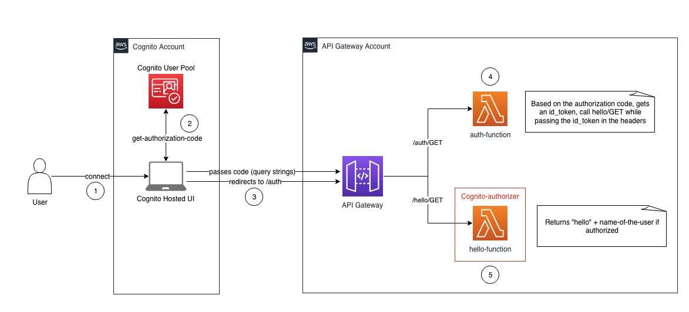

# Architecture



# How to deploy

1. Make sure you have AWS Credentials profiles for the Cognito and API Gateway accounts. If not, follow the instructions here: https://docs.aws.amazon.com/cli/latest/userguide/cli-configure-profiles.html

2. Launch the bash script with the following parameters:
- REGION: region to deploy the templates in
- COGNITO_PROFILE: name of the profile where the Cognito User Pool will be deployed
- API_PROFILE: name of the profile where the API Gateway will be deployed
- COGNITO_USERPOOL_NAME: Provide a name for the Cognito user pool
- NLB_ARN: The ARN of the Network Load Balancer
- API_URI: The URI to endpoint

```
/bash-script.sh REGION=us-east-1 COGNITO_PROFILE=<name-of-profile> API_PROFILE=<name-of-profile> COGNITO_USERPOOL_NAME=DemoPool=<name-of-the-pool> NLB_ARN=<NLB-arn> API_URI=<Endpoint>
```

3. The Cognito Hosted UI cannot be deployed programmatically, so follow the steps here to create it: https://docs.aws.amazon.com/cognito/latest/developerguide/cognito-user-pools-app-integration.html#cognito-user-pools-create-an-app-integration. 

4. Click on View the Hosted UI, Sign-in and you'll be greeted with "Hello" + name of the user you connected with

5. /whoami method -> Will return an the roles of the authenticated user, part of the custom cognito attribute "custom:Role"
6. /ecs method -> Passes the authenticated users role as part of the request headers.


